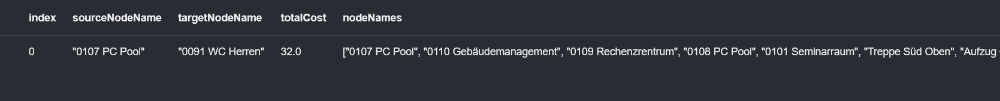

# Queries in neo4j for building plan database
a) Wie lange benötigt Herr Eck von seinem Büro zum Büro von Hr. Eiermann?
```
MATCH (source:Raum {name: '0106 Fakultät IN'}), (target:Raum {name: '0004 Fakultät IN'})
CALL gds.shortestPath.dijkstra.stream('graphyyy', {
    sourceNode: source,
    targetNode: target,
    relationshipWeightProperty: 'zeit'
})
YIELD index, sourceNode, targetNode, totalCost, nodeIds, costs, path
RETURN
    index,
    gds.util.asNode(sourceNode).name AS sourceNodeName,
    gds.util.asNode(targetNode).name AS targetNodeName,
    totalCost,
    [nodeId IN nodeIds | gds.util.asNode(nodeId).name] AS nodeNames,
    costs,
    nodes(path) as path
ORDER BY costs
```


b) Welcher Weg ist der kürzeste Weg vom Eingang auf der Südseite zu einem Poolraum in
der ersten Etage und mind. 30 Sitzplätze?
```

```
c) Wie lange benötigt man auf dem kürzesten Weg von O107 zur nächsten Herrentoilette?
```
MATCH (source:Raum {name: '0107 PC Pool'}), (target:Raum {name: '0091 WC Herren'})
CALL gds.shortestPath.dijkstra.stream('graphyyy', {
    sourceNode: source,
    targetNode: target,
    relationshipWeightProperty: 'zeit'
})
YIELD index, sourceNode, targetNode, totalCost, nodeIds, costs, path
RETURN
    index,
    gds.util.asNode(sourceNode).name AS sourceNodeName,
    gds.util.asNode(targetNode).name AS targetNodeName,
    totalCost,
    [nodeId IN nodeIds | gds.util.asNode(nodeId).name] AS nodeNames,
    costs,
    nodes(path) as path
ORDER BY costs
```



d) Finden Sie den kürzesten Weg für einen Rollstuhlfahrer vom Eingang Süd zum Raum
O107. Da ein Rollstuhlfahrer die Treppen nicht verwenden kann, stehen hier nur Gang
und Aufzug zur Verfügung.
```

```