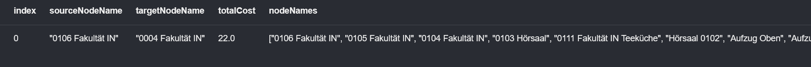
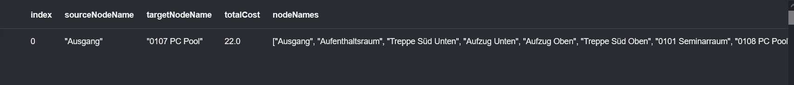
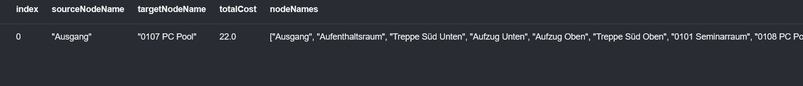

# Queries in neo4j for building plan database
a) Wie lange benötigt Herr Eck von seinem Büro zum Büro von Hr. Eiermann?
```
MATCH (source:Raum {art: 'Raum'}), (target:Raum {art: 'Raum'})
WHERE source.personen CONTAINS 'Eck' AND target.personen CONTAINS 'Eiermann'
CALL gds.shortestPath.dijkstra.stream('graphyyy', {
    sourceNode: source,
    targetNode: target,
    relationshipWeightProperty: 'zeit'
})
YIELD index, sourceNode, targetNode, totalCost, nodeIds, costs, path
RETURN
    index,
    gds.util.asNode(sourceNode).name AS sourceNodeName,
    gds.util.asNode(targetNode).name AS targetNodeName,
    totalCost,
    [nodeId IN nodeIds | gds.util.asNode(nodeId).name] AS nodeNames,
    costs,
    nodes(path) as path
ORDER BY costs
```



b) Welcher Weg ist der kürzeste Weg vom Eingang auf der Südseite zu einem Poolraum in
der ersten Etage und mind. 30 Sitzplätze?
```
MATCH (source:Raum {art: 'Ausgang'}), (target:Raum {art: 'Raum'})
WHERE target.name CONTAINS 'Pool' AND target.etage = 1 AND target.plätze >= 30
CALL gds.shortestPath.dijkstra.stream('graphBuilding', {
    sourceNode: source,
    targetNode: target,
    relationshipWeightProperty: 'zeit'
})
YIELD index, sourceNode, targetNode, totalCost, nodeIds, costs, path
RETURN
    index,
    gds.util.asNode(sourceNode).name AS sourceNodeName,
    gds.util.asNode(targetNode).name AS targetNodeName,
    totalCost,
    [nodeId IN nodeIds | gds.util.asNode(nodeId).name] AS nodeNames,
    costs,
    nodes(path) as path
ORDER BY costs
```



c) Wie lange benötigt man auf dem kürzesten Weg von O107 zur nächsten Herrentoilette?
```
MATCH (source:Raum {name: '0107 PC Pool'}), (target:Raum {art: 'Raum'})
WHERE target.name CONTAINS 'Herren'
CALL gds.shortestPath.dijkstra.stream('graphyyy', {
    sourceNode: source,
    targetNode: target,
    relationshipWeightProperty: 'zeit'
})
YIELD index, sourceNode, targetNode, totalCost, nodeIds, costs, path
RETURN
    index,
    gds.util.asNode(sourceNode).name AS sourceNodeName,
    gds.util.asNode(targetNode).name AS targetNodeName,
    totalCost,
    [nodeId IN nodeIds | gds.util.asNode(nodeId).name] AS nodeNames,
    costs,
    nodes(path) as path
ORDER BY costs
```


d) Finden Sie den kürzesten Weg für einen Rollstuhlfahrer vom Eingang Süd zum Raum
O107. Da ein Rollstuhlfahrer die Treppen nicht verwenden kann, stehen hier nur Gang
und Aufzug zur Verfügung.
```
MATCH (source:Raum {art: 'Ausgang'}), (target:Raum {art: 'Raum'})
WHERE target.name CONTAINS '0107 PC Pool'
CALL gds.shortestPath.dijkstra.stream('graphBuilding', {
    sourceNode: source,
    targetNode: target,
    relationshipWeightProperty: 'zeit'
})
YIELD index, sourceNode, targetNode, totalCost, nodeIds, costs, path
RETURN
    index,
    gds.util.asNode(sourceNode).name AS sourceNodeName,
    gds.util.asNode(targetNode).name AS targetNodeName,
    totalCost,
    [nodeId IN nodeIds | gds.util.asNode(nodeId).name] AS nodeNames,
    costs,
    nodes(path) as path
ORDER BY costs
```

