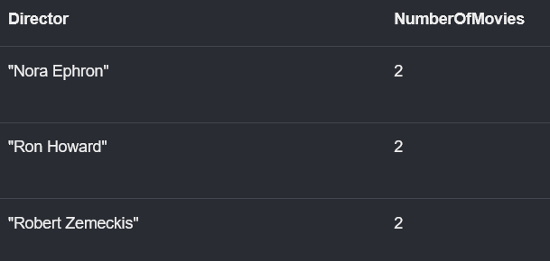
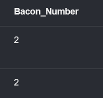

# Queries for movie database in neo4j

a) Welches sind die drei häufigsten Directors, mit denen Tom Hanks zusammen gedreht hat?
Geben Sie die Director-Namen und die Anzahl gemeinsamer Filme aus.
```
MATCH (tom:Person {name: "Tom Hanks"})-[:ACTED_IN]->(:Movie)<-[:DIRECTED]-(director:Person)
WHERE tom <> director
WITH director, count(*) AS numMovies
ORDER BY numMovies DESC
RETURN director.name AS Director, numMovies AS NumberOfMovies
LIMIT 3
```


b) Fügen Sie eine KNOWS-Beziehung zwischen allen Akteuren (Regisseuren und
Schauspielern) ein, die zusammen einen Film gedreht habe. Die Relation soll zwischen allen
Akteueren, auch z.B. zwischen Schauspielern untereinander angelegt werden. Stellen Sie
aber sicher, dass eine Person sich nicht selbst kennt. Zählen Sie anschliessend die Anzahl
eingefügter Relationen. 

```
MATCH (p1:Person)-[:ACTED_IN|DIRECTED]->(m:Movie)<-[:ACTED_IN|DIRECTED]-(p2:Person)
WHERE p1 <> p2
CREATE (p1)-[:KNOWS]->(p2)
```


c) Geben Sie Empfehlungen für mögliche Filmpartner von Keanu Reeves an. Diese sollen
Keanu Reeves nicht direkt kennen, aber Bekannte sollen sie kennen. 

```
MATCH (keanu:Person {name: "Keanu Reeves"})-[:ACTED_IN]->(:Movie)<-[:ACTED_IN]-(coActor),
      (coActor)-[:ACTED_IN]->(:Movie)<-[:ACTED_IN]-(recommendation),
      (recommendation)-[:ACTED_IN]->(:Movie)<-[:ACTED_IN]-(recommendedCoActor)
WHERE NOT (keanu)-[:ACTED_IN]->(:Movie)<-[:ACTED_IN]-(recommendedCoActor)
  AND keanu <> recommendedCoActor
RETURN DISTINCT recommendedCoActor.name AS RecommendedActor
```


d) Die Bacon-Zahl ist die Länge der kürzesten Kette von Schauspielern, die gemeinsam in
einem Film spielen, zu Kevin Bacon. Berechnen Sie die Bacon-Zahl zwischen Kevin Bacon
und Keanu Reeves.
```
MATCH p=shortestPath(
(kevin:Person {name: "Kevin Bacon"})-[:ACTED_IN*..20]-(keanu:Person {name: "Keanu Reeves"})
)
RETURN length(p)/2 AS Bacon_Number
```
